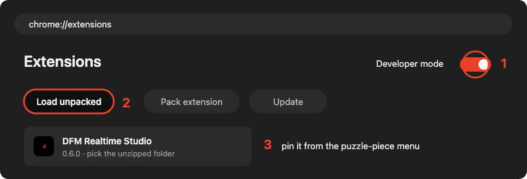
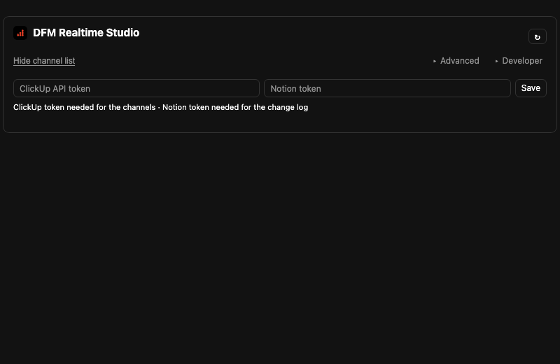
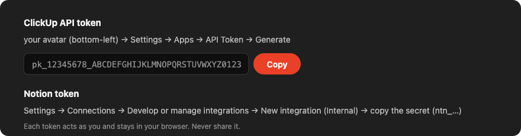
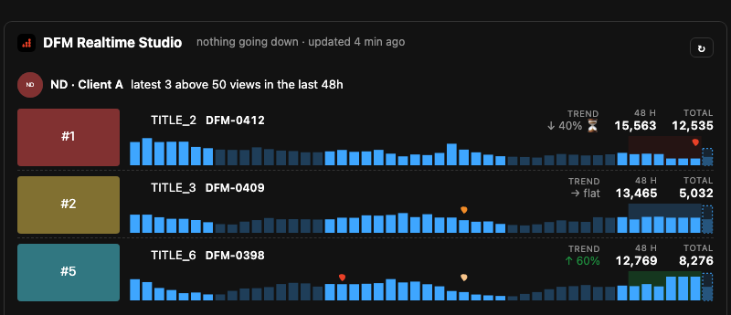

# DFM Realtime Studio

Chrome extension for the Dragonfruit team: realtime views, trends, A/B tests and title/thumbnail changes for our client channels, plus the packaging card inside YouTube Studio.

## Install

**Managed (preferred).** Sign in to Chrome with your @dragonfruitmedia.co account. Once the Workspace admin has applied the policy, the extension installs and updates on its own. Nothing to do.

**Manual (until then).**

1. [Download dfm-realtime-studio.zip](https://dragonfruit-media-co.github.io/studio-realtime-updates/dfm-realtime-studio.zip) and unzip it into a folder you will keep (not Downloads).
2. Open `chrome://extensions`, switch on **Developer mode**, click **Load unpacked**, pick the unzipped folder, pin the icon.

To update later: download the zip again, unzip over the same folder, press the reload arrow on `chrome://extensions`.

## Setup (once)

Open the extension and paste your two tokens, then press **Save**.

- **ClickUp API token** — ClickUp → your avatar → Settings → **Apps** → API Token → Generate → copy (`pk_…`).
- **Notion token** — Notion → Settings → **Connections** → Develop or manage integrations → New integration (Internal) → copy the secret (`ntn_…`). Give the integration access to the *DFM Realtime Studio* page that holds the two databases.

That's it: your client channels appear from the ClickUp Client Database. Press **Add** on the ones you want to follow.

---

Admin: extension id `iokdekijoeafjfgmecfaohgembnjbcga`, update URL `https://dragonfruit-media-co.github.io/studio-realtime-updates/update.xml`. This repo only hosts the release files; the source is private.
